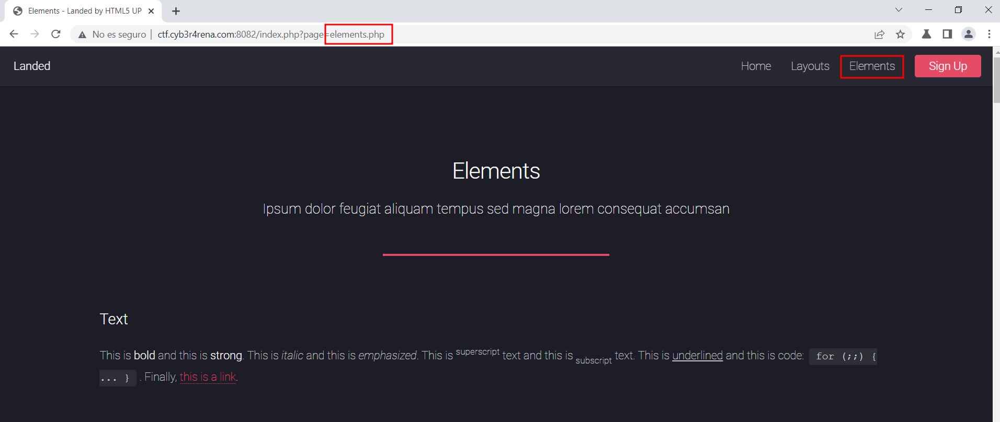
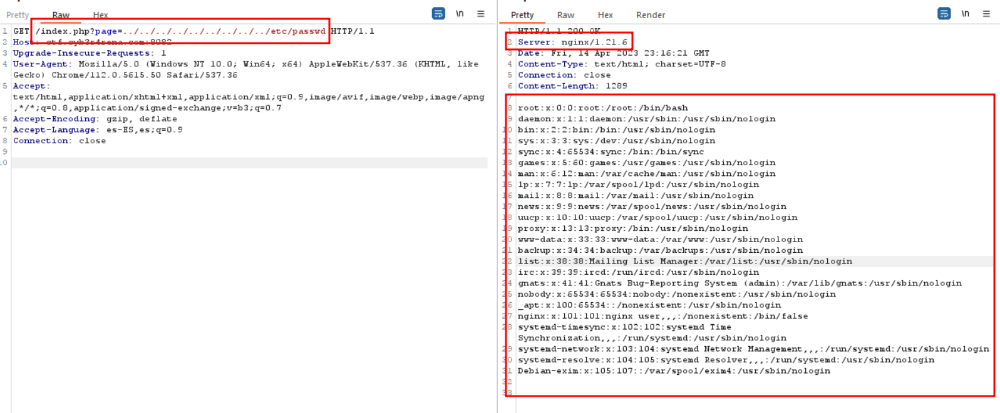
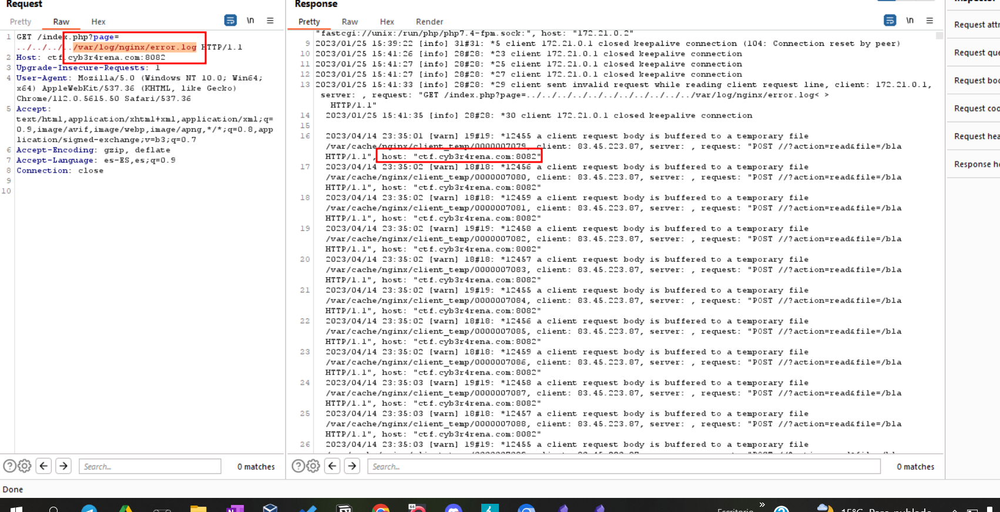
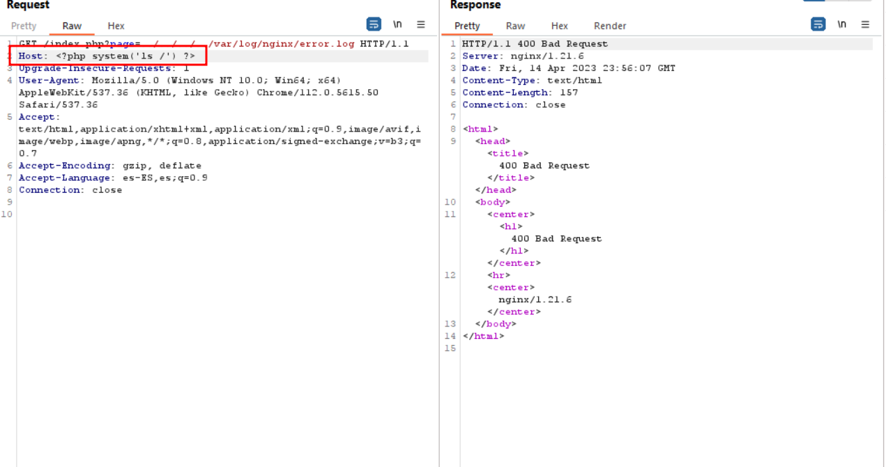
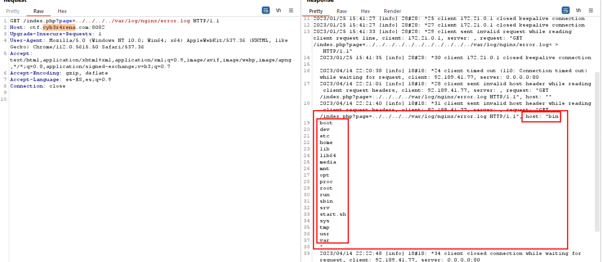

## Descripción
Has sido contratado para realizar un pentest a esta aplicación web porque el cliente ha comentado que han detectado actividad sospechosa en la red interna de la compañía y creen que esta aplicación ha sido el punto de entrada de los atacantes.  
¿Puedes comprobar si ha sido así?
## Solución
Al acceder al enlace que nos proporcionan podemos observar una web sin apenas funcionalidades. Al hacer click en alguno de los botones del menu nos aparece en la url un parametro **page** haciendo referencia al archivo que quiere leer. 

Por lo que vamos a ver si es vulnerable a **LFI** intentando leer el archivo **/etc/passwd**
> **LFI** (Local File Inclusion o Inclusión Local de Archivos) es una vulnerabilidad web que permite a un atacante acceder a archivos del servidor mediante la manipulación de rutas en las solicitudes HTTP

Puedes ir probando sucesivamente ../etc/passwd, luego ../../etc/passwd, ../../../etc/passwd hasta llegar al directorio raiz y poder leer /etc/passwd, o tambien puedes añadir bastantes ../../../../../../../../etc/passwd. Para asegurarnos de llegar al directorio raiz.


Ya tenemos **LFI** pero no sabemos el nombre del archivo que queremos leer ni donde esta ubicado, por lo que tenemos dos formas de escalar este LFI a RCE:
>* **RFI** (Remote File Inclusion) es una vulnerabilidad en aplicaciones web que permite a un atacante incluir archivos remotos en el código de la aplicación, lo que puede resultar en la ejecución de código no autorizado en el servidor web.
>* **Log Poisoning**: consiste en leer un fichero de registro (log) por medio de una “inclusión de fichero” (**LFI**) y modificar el texto de las cabeceras (ej. User-agent) para escribir código arbitrario y conseguir que sea ejecutado (**RCE**) por la máquina víctima

Probando algunas técnicas de RFI no hubo resultado, por lo que vamos a intentar con Log Poisoning. 
Sabiendo que en la captura anterior nos desveló el servidor que esta usando, **nginx**, vamos a acceder a `/var/log/nginx/error.log` para ver headers se muestran el el log.

Por lo que vamos a intentar listar el directorio raiz añadiendo este simple código php.
```php
<?php system('ls /') ?>
```

Al mandar la respuesta anterior dio un error el cual en `/var/log/ngnix/error.log` se debería ver reflejado.

Y ya tendriamos RCE, ahora podriamos utilizar algún comando para encontrar la flag filtrando por nombres de archivo(fla* o flag*) o contenido del archivo(FlagFormat{).

## Conclusion
En conclusión podemos determinar que un LFI puede desencadenar varias vulnerabilidades bastante críticas. Por lo que el desarrollador debería de implementar varias medidas de seguridad como puede ser una WhiteList que contenga solo los ficheros php que pueden ser visibles para el usuario. Otra medida de seguridad sería que todos los archivos esten en el path de la aplicación para no usar otras directorio y así crear una BlackList con caracteres especiales como pueden ser `/$;'.*`.
 
