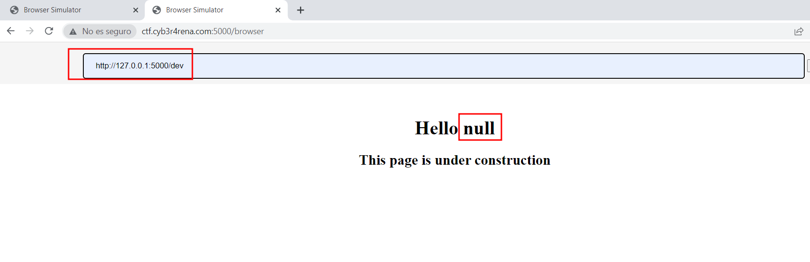

## Descripción
¿Existe la navegación segura?
## Solución
Al acceder a la página web esta nos devuelve un 403. Por lo que vamos intentar enumerar algun directorio para poder avanzar el reto.

Una vez que encontramos estos dos archivos, podemos acceder solo a uno de ellos. En el cual al mandar una url nos devuelve la página que le hemos pedido, por lo que de primera vista parece vulnerable a SSRF

Lo primero que intente fue si podia leer algun archivo con file:// pero no fue posible. Despues de un rato peleandome, intentando acceder a /dev me di cuenta que no le estaba añadiendo el puerto en el que se encuentra este servicio, así que le añadí el puerto y la ruta para conseguir este SSRF. 

Una vez que accedemos a /dev vemos que de algún lado(parametro,headers,cookies) esta cogiendo un nombre que en este caso es igual a null, ya que en nuestra request no vemos ningun parametro ni header que haga la función que comenté anteriormente

Por lo que vamos a fuzzear los parámetros, para ello vamos a configurar nuestro intruder primero seleccionando el texto que queremos bruteforcear, segundo le damos a añadir $ y por último nos vamos a payloads para configurar la lista de palabras que vamos a bruteforcear. 
En este caso use la siguiente wordlist:
https://raw.githubusercontent.com/xsscx/Commodity-Injection-Signatures/master/parameter/well-known-parameter-names-brute-force.txt

Una vez que hemos iniciado el ataque podemos observar como la longitud de una de las peticiones es mayor. Al mirar el response podemos observar como nos a añadido nuestro texto en el html de la página

Una vez que estamos en el siguiente punto, en el que el input del usuario se ve reflejado en la página web, podemos probar varias vulnerabilidades como XSS, SSTI,...
En este caso este reto es vulnerable a SSTI, ya que al introducir el siguiente input:
```
{{7*7}}
```
El servidor nos devuelve un `Hello 49` en vez de Hello `{{7*7}}`
Por lo que vamos a mirar que subclasses están incluidas, para ello vamos a utilizar el siguiente comando.
```
{{''.__class__.mro()[1].__subclasses__()}}
```
> Tenga en cuenta tenemos un array de clases y cada array de clases tienen subclasess, entonces si en la posición 1 no encontramos subclasses interesantes podemos mirar en la posición 2.


Una vez que tenemos la subclase que queremos usar vamos a filtrar para conseguir la posición en la que se encuentra.
```
{{''.__class__.mro()[1].__subclasses__()[380:400]}}
```

En este caso la subclase que queremos usar es subproccess.Popen que nos permite abrir nuevos procesos
```
{{''.__class__.mro()[1].__subclasses__()[397]}}
```

Por lo que vamos a añadir el comando que queremos ejecutar y como vamos a observar ya tenemos RCE gracias a una cadena de vulnerabilidades. Ya solo nos quedaría buscar la flag para conseguir los puntos de este reto.
```
{{''.__class__.mro()[1].__subclasses__()[397]('whoami',shell=True,stdout=-1).communicate()}}
```

## Breve descripción del reto

## Conclusion
En conclusión podemos llegar a que el desarrolador deberá validar y filtrar adecuadamente las entradas del usuario, restringir el acceso a recursos internos, usar blacklists para que no se pueda acceder a **127.0.0.1** o **localhost**, y por ultimo sanitizar las plantillas del servidor.