## Descripción
Realicé una encuesta para encontrar el tipo de desafío web menos favorito de nuestro desarrollador. Los resultados de mi encuesta mostraron que Blackbox Web es, con mucho, el tipo de desafío web más frustrante. Vamos a ver cuál es tu opinión al respecto.
## Solución
Inspeccionando un poco la página, accedí a un directorio que muchas veces proporciona información valiosa, este directorio es el /robots.txt.

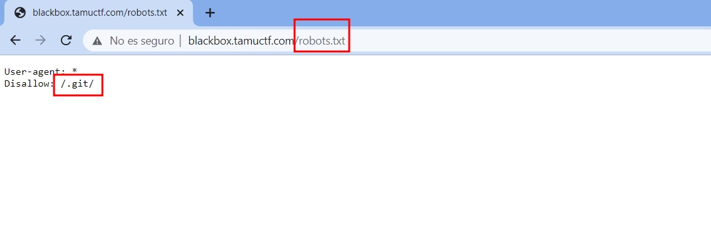
En este caso nos reveló que existia un directorio .git que se utiliza para el control de versiones, por lo que nos lo descargamos con la herramienta git-dumper
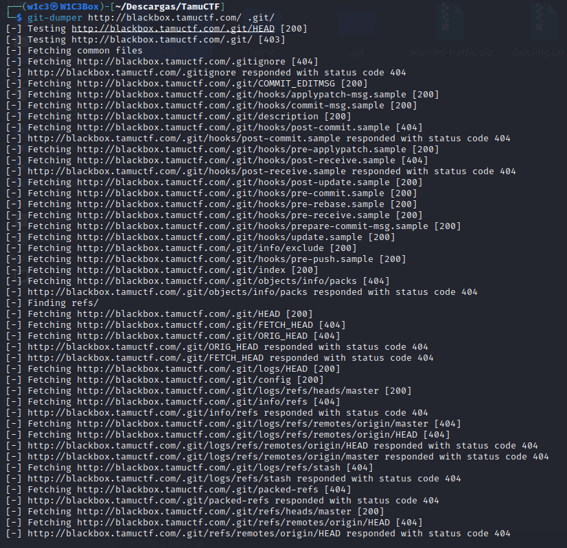
Una vez que tenemos todos los directorios, podriamos ver los commits, logs, branch que existen en el .git para ver si podiamos sacar mas información pero no fue el caso.
Por lo que analizando el codigo fuente en el index podemos observar como incluye un archivo.
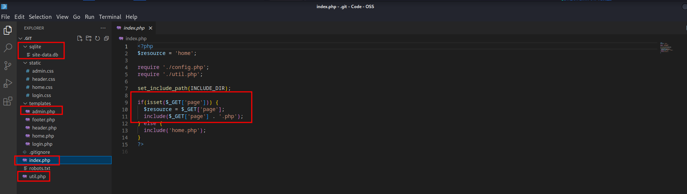
Tambien vemos otros archivos importantes que lo veremos a continuación.
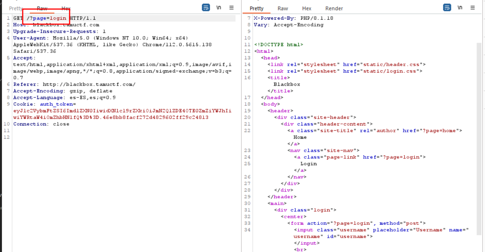
Por lo que probando algunas tecnicas de LFI en php, pude pasar el contenido del archivo /login.php a base64, así pudiendo exfiltrar el código fuente
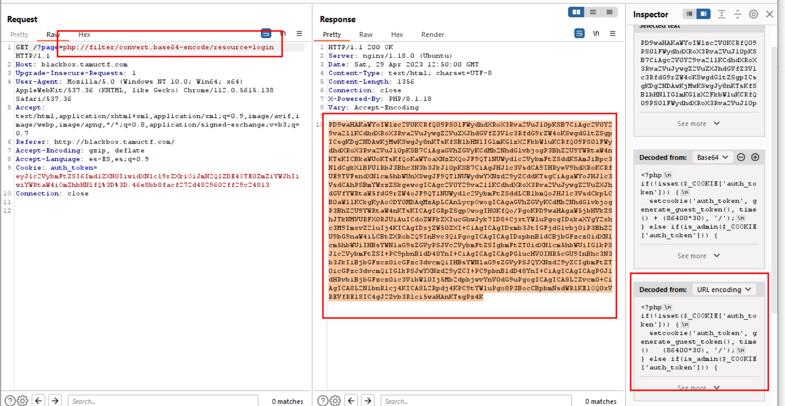
Por lo que vamos a seguir viendo el codigo para ver que podemos filtrar. Antes que nada en el .git se filtró una base de datos, vamos a ver que contiene
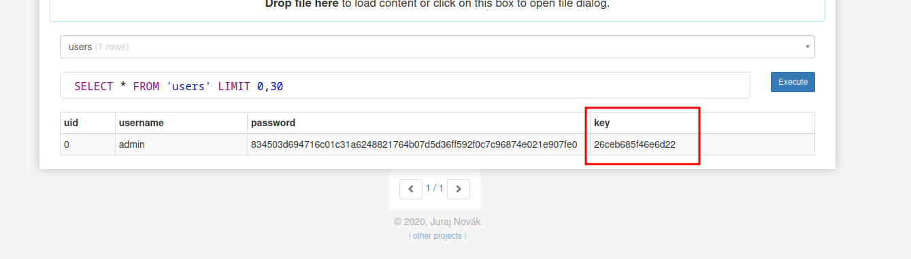
Solo contiene un registro, el registro del admin con su hash y la key que utiliza para el token
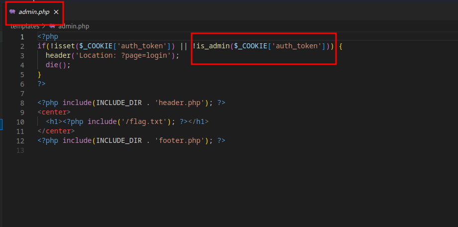
Al acceder al admin php verifica con la cookie si es admin. Esta verificación comprueba todo correctamente, pero hay una variable **Secret_Key** que la coge de algún lado
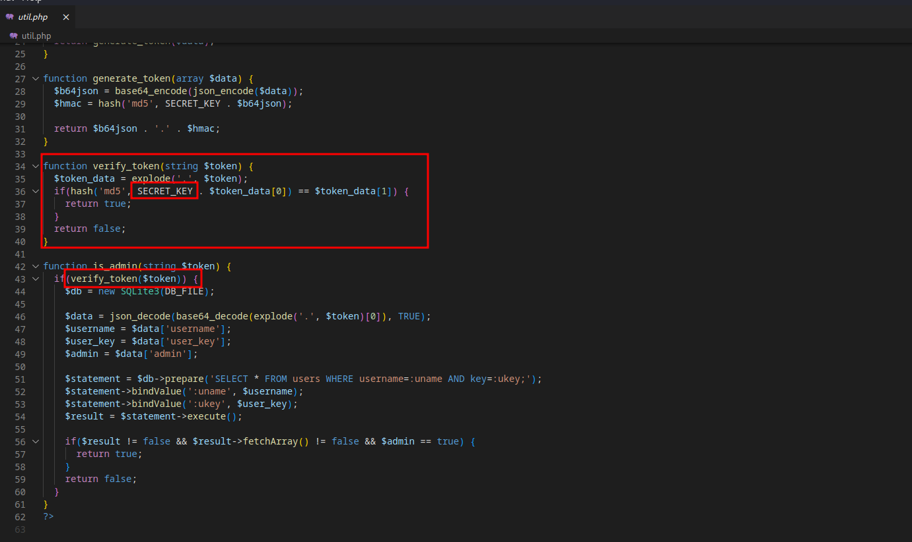
Por lo que vamos a intentar sacar el secret key con el lfi. Accediendo a config.php se puede filtrar la secret key
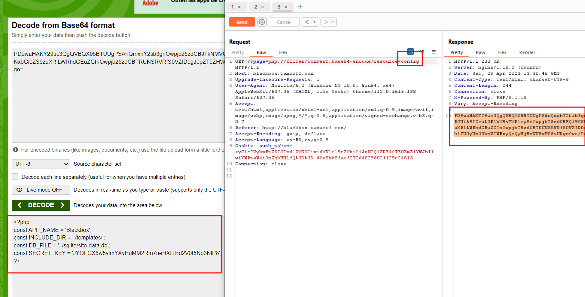
Una vez que tenemos la secret key, vamos a rellenar nuestra cookie con la información del administrador
User Cookie
```
eyJ1c2VybmFtZSI6Imd1ZXN0IiwidXNlcl9rZXkiOiJmN2Q1ZDE4OTE0ZmZiYWJhIiwiYWRtaW4iOmZhbHNlfQ%3D%3D.46e8bb8facf272d4829602ff29c24813
```
```
{"username":"guest","user_key":"f7d5d18914ffbaba","admin":false}.46e8bb8facf272d4829602ff29c24813
```
La cookie del admin deberá contener la user_key que encontramos en la base de datos, por lo que quedaría algo como esto
Admin Cookie
```
{"username":"admin","user_key":"26ceb685f46e6d22","admin":true}.?
```
Sabiendo que la segunda parte del token es el hash md5 de la Secret Key + el json en b64 que acabamos de generar. Por lo que vamos a pasarlo a base64
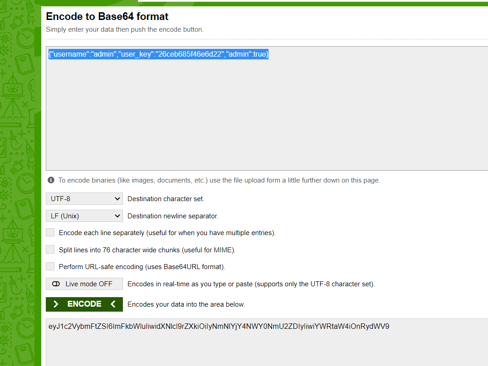
ahora que tenmos el b64 vamos a generar el md5
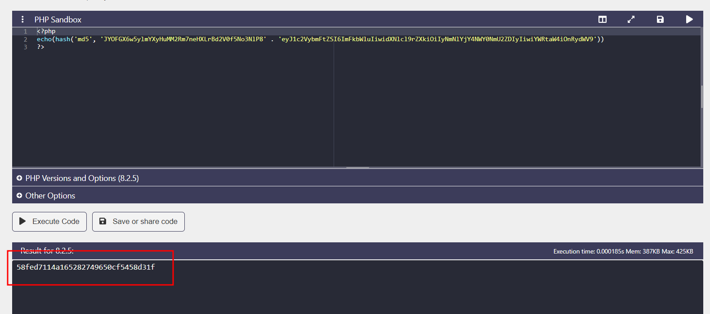
Ahora solo tenemos que juntar el base64 que contiene el user, la key y el boolean + el md5 que acabamos de generar y hacer la petición a /admin.php
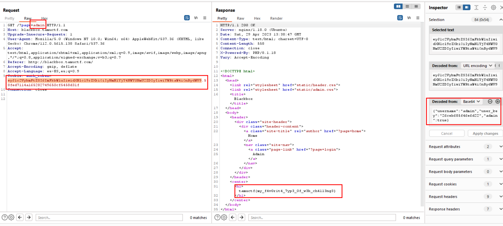