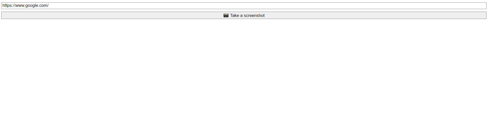
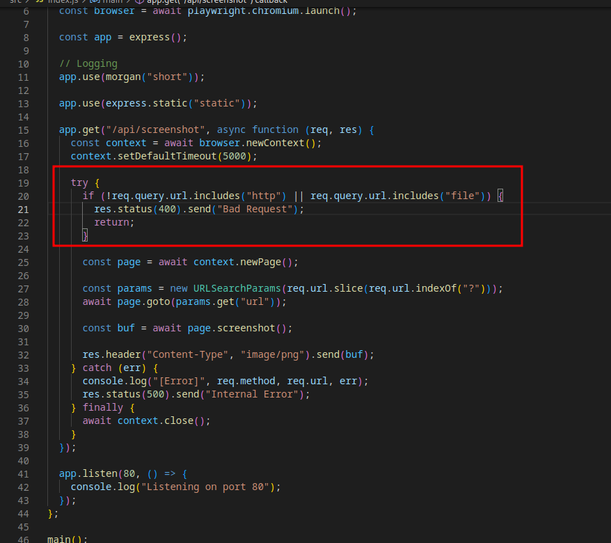
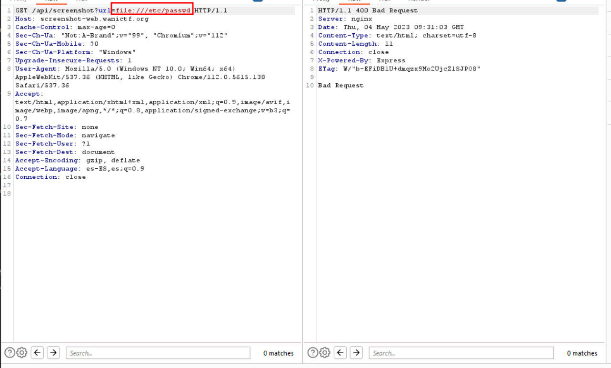
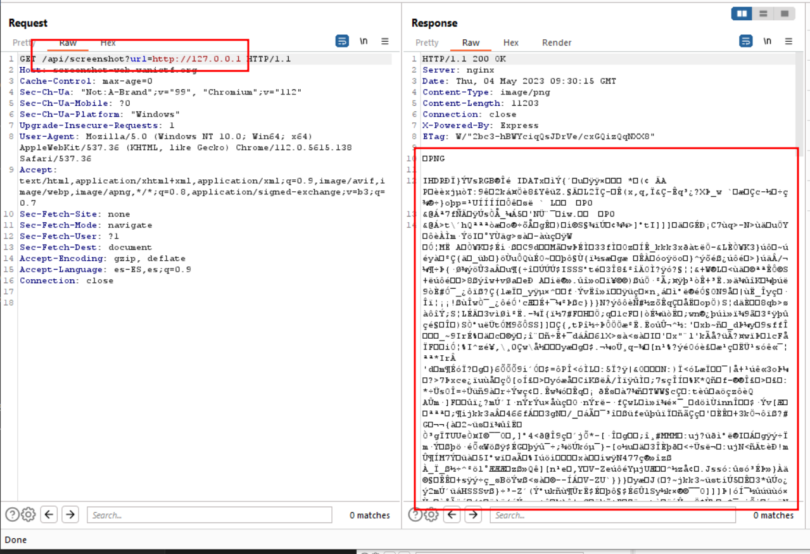
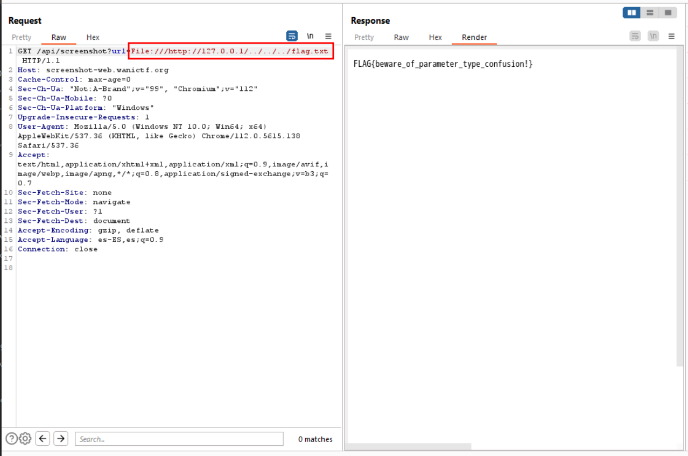

# Descripción
Una aplicación que toma capturas de pantalla de tus sitios web favoritos.
# Solución
Al acceder a la página web podemos ver como es una página demasiado simple. Solo tiene una funcionalidad, que es la de recibir una url, acceder con un navegador a la url y hacer una captura de pantalla

Como en este desafio nos proporcionan el codigo fuente vemos que realiza una comprobación que tenemos que bypasear, ya que **HTTP** debe estar incluido en nuestra petición y **FILE** no puede estar incluido

Para comprobarlo vamos a intentar leer el archivo /etc/passwd pero sin exito

Como bien dijimos antes, el filtro que tenemos que bypassear debe contener la string **http** o no incluir la string "**file**". 

Una vez que estamos en el punto anterior, sabiendo que existe el SSRF y conociendo el filtro que tenemos que bypassear vamos a añadir **File://** al principio y **../../../../flag.txt** o **../../../../etc/passwd** al final. Con esto vamos a poder leer el archivo **flag.txt** para completar nuestro desafio 

