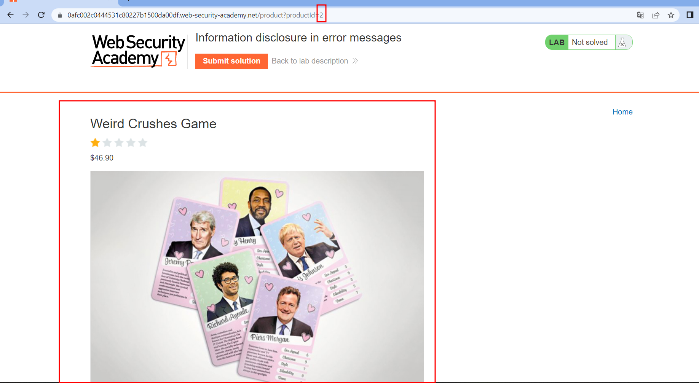
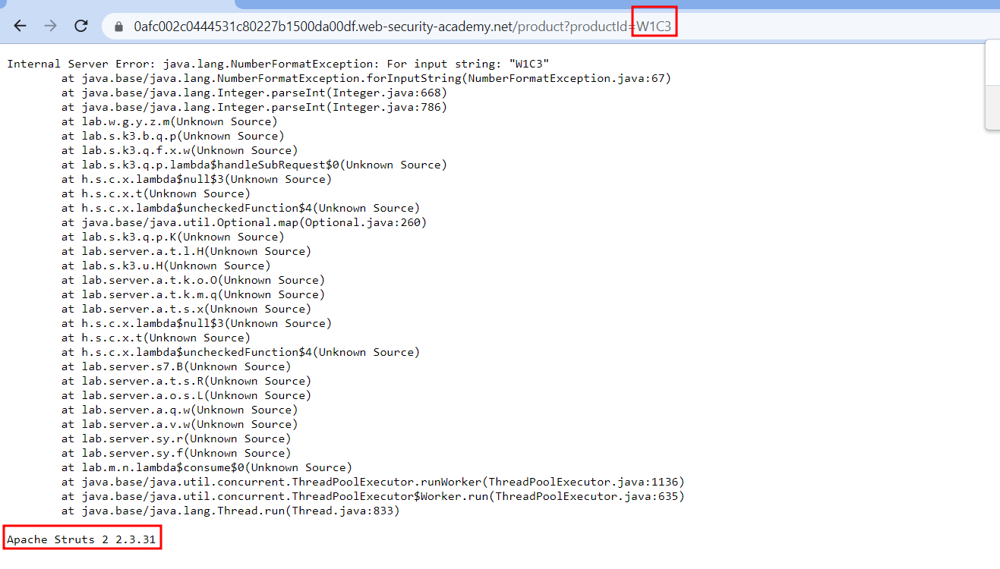

# Information disclosure in error messages
#Org-PortSwigger 

#Web 

#InformationDisclosure

#Status-Done 
## Descripción
Los mensajes de error detallados de este laboratorio revelan que está utilizando una versión vulnerable de un marco de trabajo de terceros. Para resolver el laboratorio, obtenga y envíe el número de versión de este framework.
## Solución
En este desafío, contamos con un sitio web que gira en torno a una tienda en línea, lo que permite a los usuarios ver información detallada de los productos.

Sin embargo, al ingresar un ID de producto inexistente, el servidor nos proporciona un mensaje de error, que incluye información sobre la versión de Apache que se está utilizando.

## Conclusion
Esto podría representar un riesgo potencial para la seguridad, ya que un atacante con conocimiento de la versión del servicio podría buscar activamente exploits vulnerables dirigidos a esa versión específica. Además, el atacante podría examinar el registro de cambios de las versiones posteriores para identificar los parches restantes sin abordar y luego proceder a explotarlos en consecuencia.

