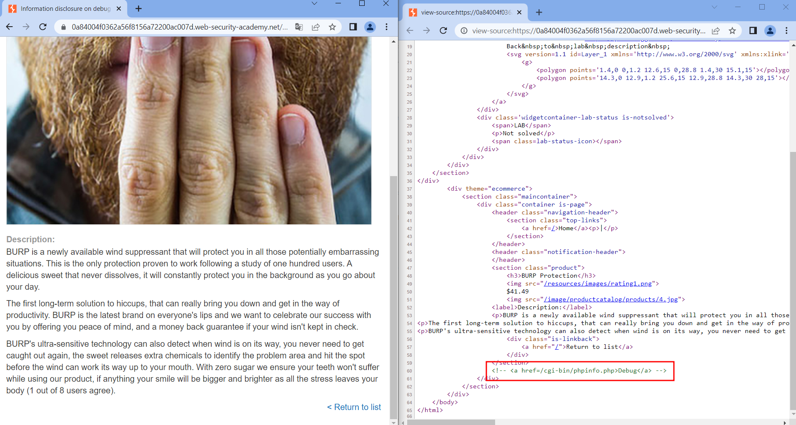
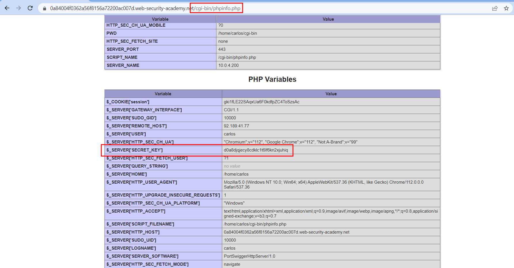

# Information disclosure on debug page
#Org-PortSwigger 

#Web 

#InformationDisclosure

#Status-Done 
## Descripción
Este laboratorio contiene una página de depuración que revela información confidencial sobre la aplicación. Para resolver el laboratorio, obtenga y envíe la `SECRET_KEY` variable de entorno.
## Solución
En este reto nos presentan la misma aplicación web, pero en este caso la información que nos proporciona es diferente, ya que cuando estamos viendo los detalles de un producto y miramos el código fuente observamos como hay un endpoint que esta comentado. 

Al acceder a este endpoint podemos observar información valiosa como la clave secreta accesible por cualquier usuario. 

## Conclusión
Con este lab hemos aprendido que es importante no tener nada comentado que no vayamos a utilizar, como en este caso el endpoint del `php.info`. Otras de las cosas que debería de comprobar el desarrollador es el control de acceso de la aplicación, para que usuarios sin privilegios no puedan acceder a este tipo de información.