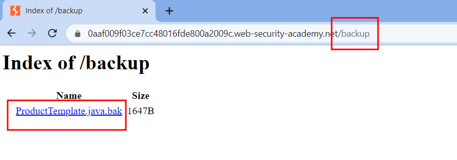
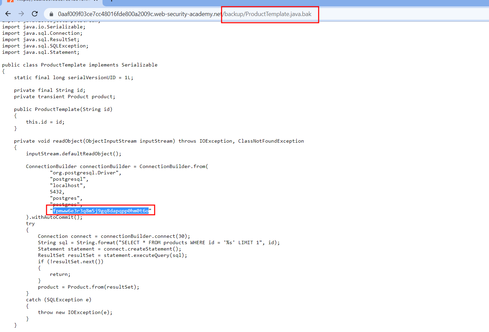

# Source code disclosure via backup files
#Org-PortSwigger 

#Web 

#InformationDisclosure

#Status-Done 
## Descripción
Este laboratorio filtra su código fuente a través de backup en un directorio oculto. Para resolver el laboratorio, identifique y envíe la contraseña de la base de datos, que está codificada en el código fuente filtrado.
## Solución
Sabiendo que que este servidor almacena backups en algun directorio, decidí verificar si el directorio `backup` existe, en este caso fue un acierto, pero en el caso contrario podriamos bruteforcear directorios que alguna herramienta como `gobuster`, `dirb`, `wfuzz`.

Al acceder al backup nos encontramos con una clase en Java la cual contiene la clave de la base de datos hardcodeada en el código

## Conclusion
En este laboratorio igual que el anterior podemos sacar la conclusión que el desarrollador tiene que mirar los permisos para denegar acceso a usuarios sin privilegios a acceder a este tipo de directorio o archivo. También otra de las cosas a destacar es el hardcodeo de credenciales, ya que gracias a esta información tendriamos el usuario y la contraseña de la base de datos
