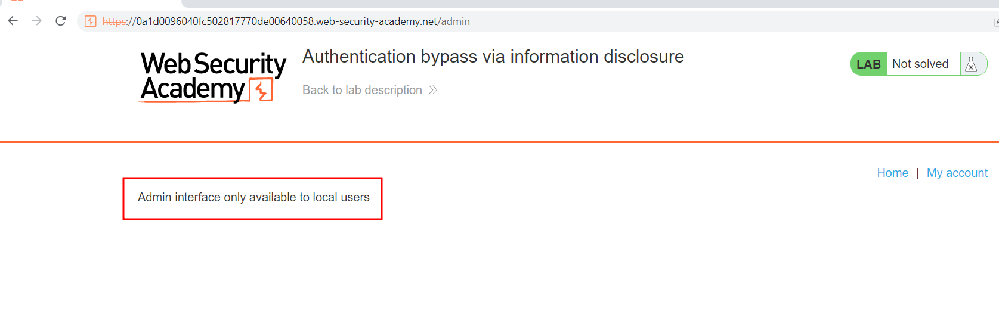

# Authentication bypass via information disclosure
## Descripción
La interfaz de administración de este laboratorio tiene una vulnerabilidad de omisión de autenticación, pero no es práctico explotarla sin el conocimiento de un encabezado HTTP personalizado utilizado por el front-end.

Para resolver el laboratorio, obtenga el nombre del encabezado y luego utilícelo para omitir la autenticación del laboratorio. Acceda a la interfaz de administración y elimine la cuenta de Carlos.

Puede iniciar sesión en su propia cuenta con las siguientes credenciales: `wiener:peter`
## Solución
En este laboratorio hay tres puntos importantes.
* Nos proporcionan credenciales de acceso
* Nos piden que accedamos a la interfaz de administrador y borremos la cuenta de carlos
* Obtener un encabezado HTTP para bypasear un filtro
Una vez que estemos logueados con las credenciales proporcionadas, accedemos a la interfaz de administración

Pero hay un filtro que impone el servidor que la interfaz de admin es solo accesible para los usuarios que se encuentran en local. 
Por lo que hay un método HTTP que nos puede desvelar información importante.
El método  `TRACE` que está diseñado para fines de diagnóstico. Si está habilitado, el servidor web responderá a las solicitudes que utilizan el método TRACE haciendo eco en su respuesta de la solicitud exacta que se recibió.

Una vez sabemos cual es la cabecera que verifica nuestra dirección IP, podemos enviarla en añadirla en nuestra solicitud HTTP pero añadiendo la IP 127.0.0.1 para hacerle creer que estoy en local

Finalmente hemos podido acceder al panel de administrador con la posiblidad de eliminar el usuario `carlos` para completar el lab.


Opcionalmente si el servicio no permite el método HTTP TRACE, estas son algunas de las cabeceras que usan para este tipo de verificaciones
```
X-Originating-IP: 127.0.0.1
X-Forwarded-For-Original: 127.0.0.1
Client-IP: 127.0.0.1
X-Forwarded-For: 127.0.0.1
Forwarded-For: 127.0.0.1
Access-Control-Allow-Origin: 127.0.0.1
Forwarded-For-IP: 127.0.0.1
Forwarded: 127.0.0.1
Origin: 127.0.0.1
x-Client-IP: 127.0.0.1
X-Custon-IP-Authorization: 127.0.0.1
X-Forwarded: 127.0.0.1
X-Forwarded-By: 127.0.0.1
X-Forwarded-Host: 127.0.0.1
X-Forwarder-For: 127.0.0.1
X-Remote-Addr: 127.0.0.1
X-Remote-IP: 127.0.0.1
```
## Conclusion
La conclusión que se puede sacar en este laboratorio es lo importante que es desactivar el método TRACE en un servidor en produción ya que este puede desencadenar a fuga de información, por otro lado el peligro que tiene este sistema de acceso al panel de administración.