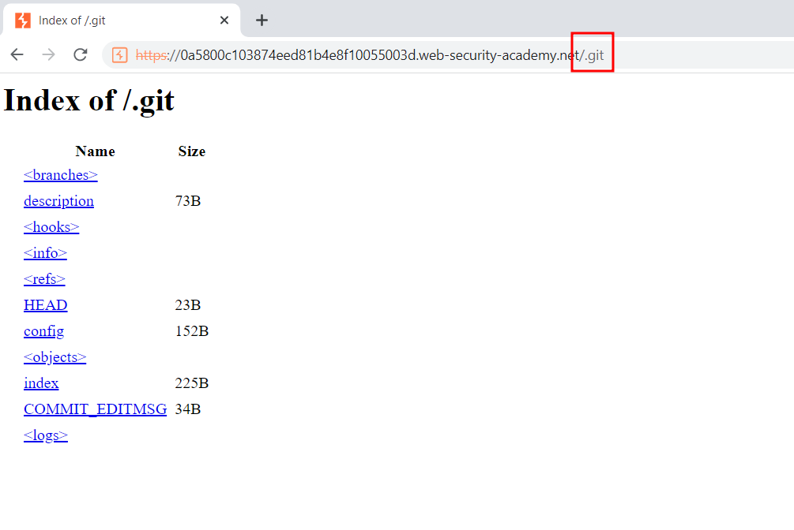
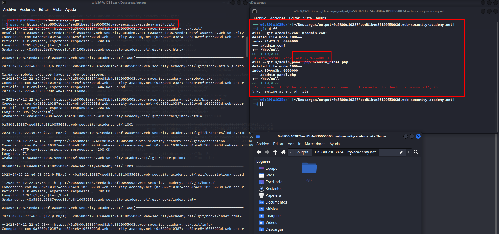
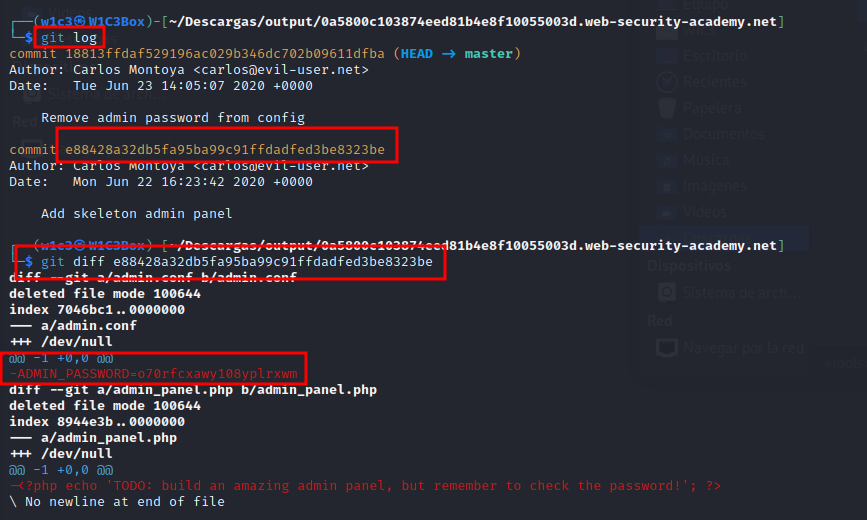
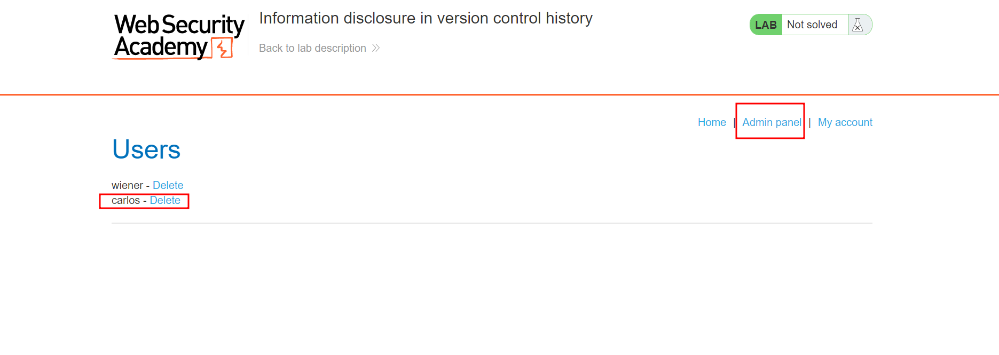

# Information disclosure in version control history
## Descripción
Este laboratorio divulga información confidencial a través de su historial de control de versiones. Para resolver el laboratorio, obtenga la contraseña del usuario `administrator`, luego inicie sesión y elimine la cuenta de Carlos.
## Solución
Teniendo en cuenta que el reto tiene una fuga de información en el historial de control de versiones, nos esta diciendo que tiene expuesto algun directorio comprometedor.
Para esto los desarrolladores suelen utilizar Github que **es un repositorio online gratuito que permite gestionar proyectos y controlar versiones de código**
El directorio que usar github para almacenar toda la información es `.git`

Vamos a descargar todo el directorio con los respectivos archivos con el comando `wget -r http://victim.ip/.git` y vamos a ver los últimos cambios que se hizo en la última versión de la aplicación con  `git diff`  

En el comando anterior vemos que en la última versión se modificó el ADMIN_PASSWORD, así que vamos a comprobar que es lo que habia anteriormente, para ello vamos a ejecutar `git log` para ver el historial de commits que se han realizado.
Una vez que tenemos el hash del commit de la version mas antigua vamos a comprobar cuales fueron los cambios respecto a la versión actual, la cual nos desvela la contraseña del administrador en texto plano

Ahora solo nos queda entrar como usuario administrator y la contraseña que hemos encontrado, acceder al panel de administrador y borrar el usuario carlos

## Conclusión
En este laboratorio como en otros anteriores hemos aprendido lo importante que es no hardcodear credenciales y el acceso a usuarios sin privilegios a directorios tan peligroso como es `.git`