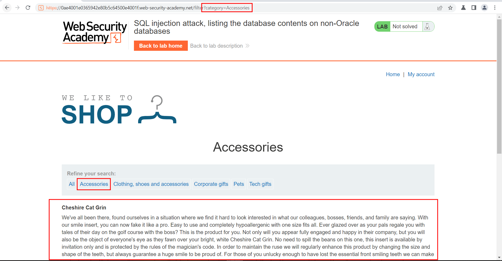
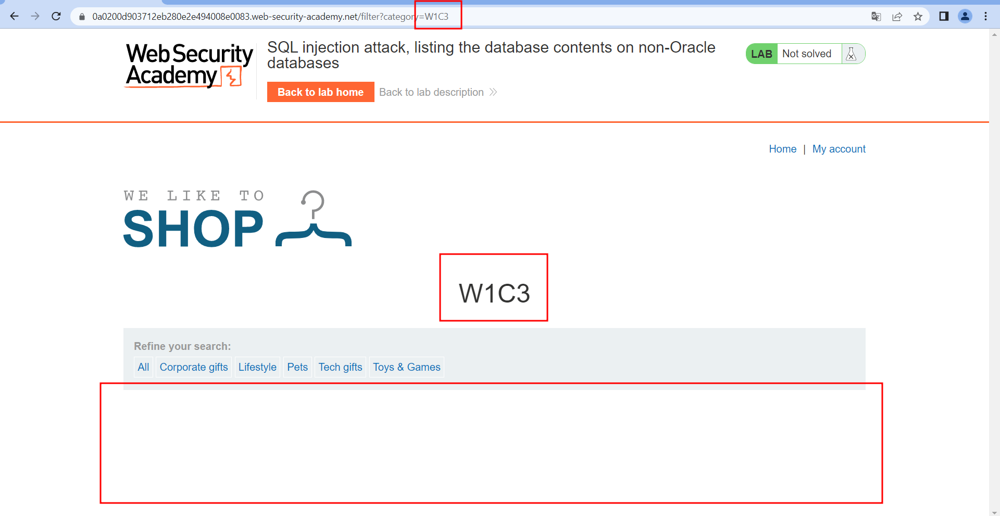
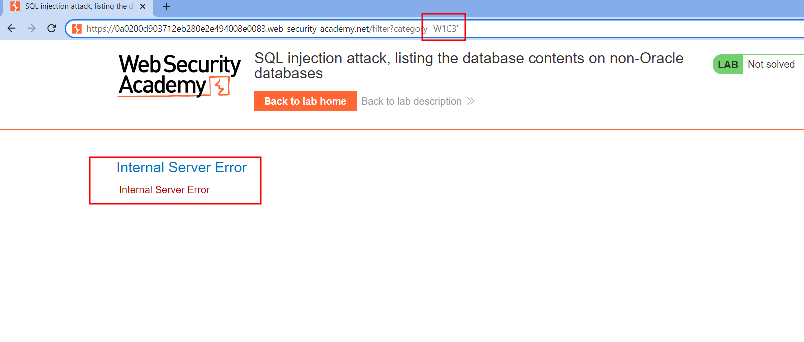
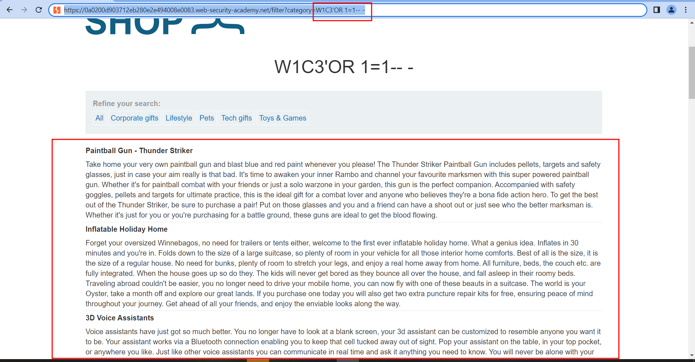
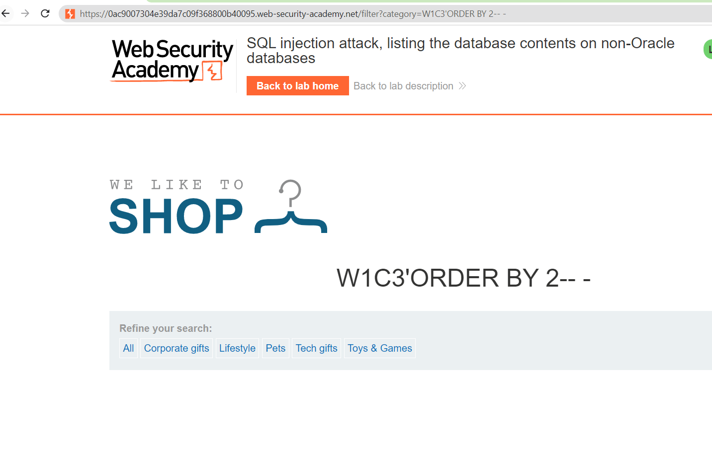
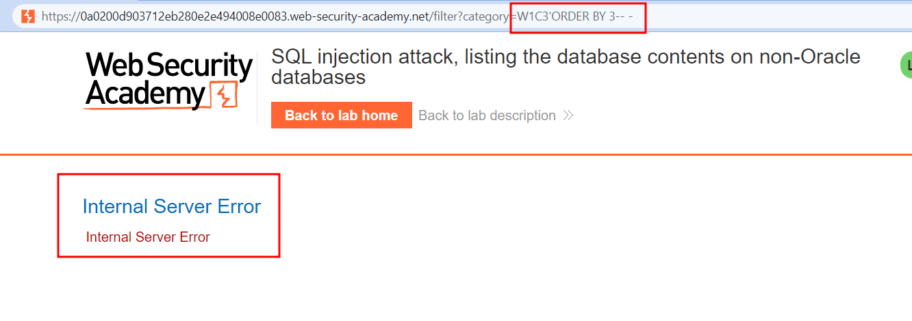
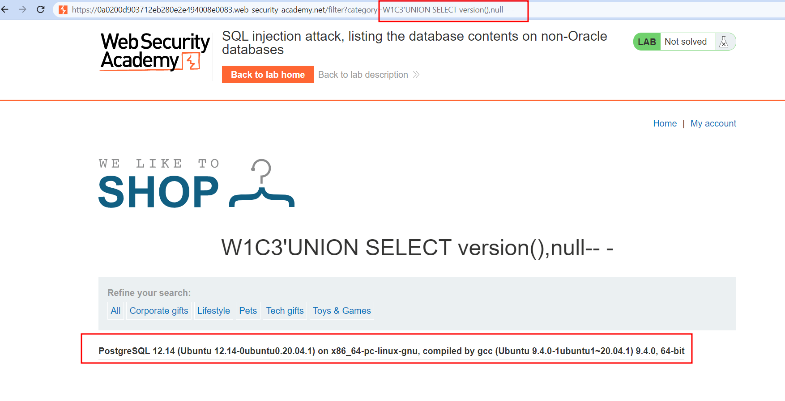

# SQL injection attack, listing the database contents on non-Oracle databases
#Org-PortSwigger

#Status-Done 

#SQLi

#Web
# Descripción

Este laboratorio contiene una vulnerabilidad [de inyección SQL](https://portswigger.net/web-security/sql-injection) en el filtro de categoría de producto. Los resultados de la consulta se devuelven en la respuesta de la aplicación para que pueda usar un ataque UNION para recuperar datos de otras tablas.

La aplicación tiene una función de inicio de sesión y la base de datos contiene una tabla que contiene nombres de usuario y contraseñas. Debe determinar el nombre de esta tabla y las columnas que contiene, luego recuperar el contenido de la tabla para obtener el nombre de usuario y la contraseña de todos los usuarios.

Para resolver el laboratorio, inicie sesión como `administrator`usuario.

# Solución
Al acceder a la web podemos visualizar que  trata de una tienda para comprar productos de diferentes categorías. Al filtrar por una categoría la aplicación realiza una consulta a la base de datos para devolvernos los productos de la categoría en cuestión.

En este caso al filtrar por accesorios la aplicación nos devuelve información de los productos de esa categoría.
Al filtrar por una categoría que no existe esta no nos devuelve datos.

Esto se vería algo así
```sql
SELECT * FROM products WHERE category = 'W1C3'
```
Para identificar si es vulnerable a SQLi vamos a añadir una comilla simple o doble para ver si es posible inyectar código.

Ahora para comprobar si podemos ver todos los productos de todas las categorias le podemos decir que me filtre por la categoria W1C3 que no existe O si 1=1, como 1 es igual a 1 nos va a devolver todos los registros de la tabla en cuestion.
Esto se vería algo así
```sql
SELECT * FROM products WHERE category = 'W1C3' OR 1=1-- -' 
```

Ahora que sabemos que es vulnerable a SQLi vamos a sacar el numero de columnas que usa, usando la técnica del Order By, Para ello tendremos que ir probando con:

```sql
'ORDER BY 1-- -
'ORDER BY 2-- -
'ORDER BY 3-- -
```


En el caso del ORDER BY 2 no recibimos un error del servidor, pero al añadir el ORDER BY 3 podemos ver un internal server error

Así que ya sabemos que existen 2 columnas en la query con la que nos tendremos que apañar.
Una vez sabemos las columnas vamos a comprobar si los columnas son de tipo texto/string/varchar

```sql
'UNION SELECT 'W1C3','W1C32'-- -
```


En este caso los dos campos son de texto, pero en este reto tenemos que conseguir las tablas y sus campos, por lo que vamos a listar todas las base datos instaladas en el sistema. No sin antes ver con que sistema de base de datos nos estamos enfrentando.

Ahora sí, existe una tabla que se llama **information_schema.schemata** que contiene una columna que se llama **SCHEMA_NAME,** el cual sirve para listar las bases de datos Non-Orcale

### Listar las bases de datos Non-Oracle

```sql
'UNION SELECT 'W1C3',SCHEMA_NAME FROM information_schema.schemata-- -
```


Una vez que tenemos listadas las bases de datos, tenemos que listar las tablas que contiene esta base de datos. Para ello existe una tabla que tiene registradas todas las tablas de las bases de datos, esta tabla se llama **information_schema.tables** y la columna que vamos a visualizar es **table_name.** También necesitaremos filtrar por la base de datos que queremos analizar para ello tenemos ****table_schema**** así que vamos a craftear nuestro payload sabiendo que la base de datos que nos interesa es la de public

### Listar las tablas de una base de datos Non-Oracle

```sql
'UNION SELECT 'W1C3',table_name FROM information_schema.tables 
WHERE table_schema = 'public'-- -
```


Aqui observamos como la base de datos public contiene una tabla en las que almacena información sobre usuarios, para saber los campos que tiene esta tabla podemos listar gracias a la tabla **information_schema.columns** de la cual vamos a extraer los **column_name** filtrando por **table_schema** y  **table_name.**

### Listar columnas de una tabla Non-Oracle

```sql
'union select 'W1C3',column_name from information_schema.columns 
where table_schema = 'public' AND table_name = 'users_rncvzd'-- -
```


De esta manera podemos enumerar el contenido de la base de datos que no son de Oracle. 

Ahora que ya tenemos tanto el nombre de la tabla como el nombre de las columnas vamos a sacar los usuarios y contraseñas

### Sacar los usuarios y contraseñas

```sql
' UNION SELECT username_jpzwqw, password_plgyjd FROM users_rncvzd-- -
```


Nos logueamos como admin y superamos el lab

